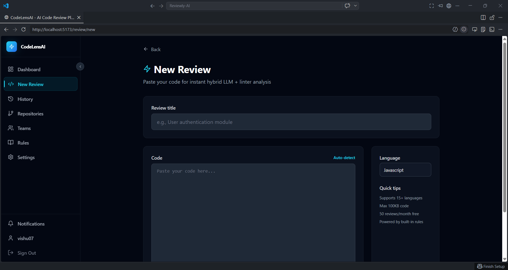
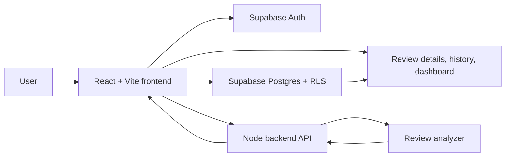

# ReviewlyAI - AI Code Review Automation

ReviewlyAI is a full-stack AI-assisted code review workspace built with React, TypeScript, Vite, Tailwind CSS, Supabase, and a lightweight Node backend. The app gives teams a fast dashboard for launching reviews, saving reports, tracking review history, and preparing repository-based review workflows.

🌐 Live demo: Coming soon  
📦 Repository: https://github.com/im-vishu/Reviewly-AI

## 📸 Screenshots

### 🏠 Landing Page

<p align="center">
  
</p>

### 📊 Dashboard

<p align="center">
  
</p>

### 🔎 Review Details

<p align="center">
  
</p>

## ✨ Features

- 🔐 Supabase email/password authentication flows
- 🧭 Protected dashboard shell with responsive sidebar navigation
- ⚡ Lovable/Bolt-style dashboard for launching review work quickly
- 🧠 Backend analysis API with a browser-side fallback analyzer
- 📝 Code review creation by pasting source code
- 🚨 Rule-based issue detection for hardcoded secrets, `eval`, console logs, unsafe HTML assignment, and swallowed exceptions
- 🖥️ Review details page with Monaco Editor read-only code views
- 📚 Review history with search, sorting, and incremental loading
- 👤 Profile management with Supabase-backed profile updates
- 🧩 Repository, team, and notification workspace pages
- 📤 Markdown export for review reports
- 🛡️ Supabase RLS migrations for per-user and team-scoped data access

## 🧰 Tech Stack

- ⚛️ React 18
- 🔷 TypeScript
- ⚡ Vite
- 🎨 Tailwind CSS
- 🧭 React Router
- 🗄️ Supabase
- 🟩 Node HTTP backend
- 👨‍💻 Monaco Editor
- ✅ ESLint
- 🎯 Lucide React

## 🗂️ Project Structure

```text
.
|-- .github/              # GitHub workflows and templates
|-- frontend/
|   |-- src/
|   |   |-- components/   # App layout and shared UI
|   |   |-- contexts/     # Auth provider
|   |   |-- lib/          # Supabase client, analyzer, API bridge, validation
|   |   |-- pages/        # Route-level pages
|   |   `-- types/        # Shared TypeScript models
|   |-- index.html
|   |-- vite.config.ts
|   |-- tailwind.config.js
|   `-- .env.example
|-- backend/
|   |-- index.mjs         # Local backend API for review analysis
|   `-- supabase/
|       `-- migrations/   # Database schema and RLS policies
|-- package.json
`-- README.md
```

## 🏗️ System Architecture



### 🔄 Runtime Flow

1. The user signs in through Supabase Auth.
2. The protected React app loads dashboard, history, repository, team, and notification data from Supabase.
3. New review submissions call `VITE_REVIEW_API_URL/api/reviews/analyze`.
4. The backend analyzes the code and returns issues, score, summary, and safe fixed-code suggestions.
5. The frontend stores the review and issue rows in Supabase under the authenticated user.
6. Realtime Supabase subscriptions refresh dashboard review data.

### 🔌 Backend API

The backend is intentionally small and dependency-free so it can run locally without adding a heavy server framework.

```text
GET  /api/health
POST /api/reviews/analyze
```

Request body for analysis:

```json
{
  "language": "javascript",
  "code": "console.log('hello')"
}
```

The frontend uses `frontend/src/lib/reviewApi.ts`. If `VITE_REVIEW_API_URL` is missing or the backend is unavailable, it falls back to the local browser analyzer in `frontend/src/lib/analyzer.ts`.

## 🔐 Environment Variables

Create a `.env` file in `frontend/`:

```env
VITE_SUPABASE_URL=your_supabase_project_url
VITE_SUPABASE_ANON_KEY=your_supabase_anon_key
VITE_REVIEW_API_URL=http://127.0.0.1:8787/api
```

`frontend/.env` is ignored by git. Do not commit secrets.

Public pages can render without Supabase values, but authentication, profile updates, review creation, history, notifications, and workspace data require a configured Supabase project.

## 🗄️ Supabase Setup

Apply the migration files in `backend/supabase/migrations` in order:

```text
20260425054649_create_codelens_base_tables.sql
20260425054724_create_codelens_review_tables.sql
20260427054501_add_audit_logs_and_session_mgmt.sql
```

These migrations create profiles, teams, team members, reviews, review issues, connected repositories, pull request review metadata, custom rules, user settings, notifications, API keys, audit logs, and row-level security policies.

## 🚀 Setup & Development

### ✅ Prerequisites

- Node.js >= 18
- npm >= 9
- Supabase project for full app functionality

### 1. 📦 Install dependencies

```bash
npm install
```

### 2. 🔧 Configure environment variables

```bash
copy frontend\.env.example frontend\.env
```

Then update `frontend/.env` with your Supabase project values.

### 3. 🟩 Run the backend

```bash
npm run backend
```

The API runs at:

```text
http://127.0.0.1:8787
```

### 4. 🖥️ Run the frontend

```bash
npm run dev
```

Open:

```text
http://127.0.0.1:5173
```

## 🧪 Quality Checks

```bash
npm run typecheck
npm run lint
npm run build
```

Current known state:

- ✅ TypeScript passes
- ✅ Production build passes
- ✅ ESLint passes

## 🧭 Routes

### 🌍 Public Routes

- `/` - Landing page
- `/auth/signin` - Sign in
- `/auth/signup` - Sign up
- `*` - 404 fallback

### 🔒 Protected Routes

- `/dashboard` - AI review workspace and recent reviews
- `/profile` - Account profile
- `/history` - Review history
- `/review/new` - Create a new review
- `/review/:id` - Review details
- `/repos` - Connected repositories
- `/teams` - Teams
- `/notifications` - User notifications

## 🧠 Analyzer Notes

The shared browser analyzer is implemented in:

```text
frontend/src/lib/analyzer.ts
```

The local backend analyzer is implemented in:

```text
backend/index.mjs
```

For production-grade AI review, keep provider keys on the backend or in Supabase Edge Functions. Do not expose private LLM provider keys in the browser.

## ☁️ Deploying

This Vite app can be deployed to platforms like Vercel, Netlify, or Cloudflare Pages. The Node backend can be deployed separately to a Node-capable host.

Recommended frontend settings:

- Build Command: `npm run build`
- Output Directory: `frontend/dist`
- Install Command: `npm install`

Set environment variables in your deployment dashboard:

- `VITE_SUPABASE_URL`
- `VITE_SUPABASE_ANON_KEY`
- `VITE_REVIEW_API_URL`

After deployment, verify landing page loading, auth redirects, protected route behavior, backend health, and review creation after sign-in.

## 🛠️ Troubleshooting

### ⚠️ Blank page or Supabase config warning

Make sure `frontend/.env` exists and contains Supabase values, then restart the dev server.

### 🩺 Backend health check fails

Start the backend:

```bash
npm run backend
```

Then open:

```text
http://127.0.0.1:8787/api/health
```

### 🔐 Protected pages redirect to sign-in

This is expected when no user is logged in. Sign in or create an account through Supabase Auth.

### 🚧 Review creation fails

Check that Supabase migrations are applied, RLS policies exist, the user is authenticated, and the backend is running or browser fallback is enabled.

## ✅ Production Readiness Checklist

- [ ] Apply all Supabase migrations
- [ ] Configure Supabase Auth redirect URLs
- [ ] Enable required OAuth providers
- [ ] Deploy the backend API
- [ ] Add provider-backed AI review on the backend
- [ ] Add automated tests for auth guards, analyzer behavior, and review creation
- [ ] Resolve remaining npm audit advisories
- [ ] Clean remaining ESLint warnings
- [ ] Update screenshots after UI changes

## 🤝 Contributing

PRs are welcome.

```bash
npm run typecheck
npm run lint
npm run build
```

## 📄 License

MIT

ReviewlyAI - AI Code Review Automation, created by Vishant Chaudhary.
