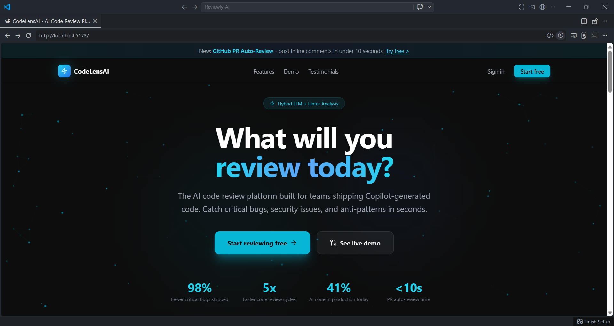
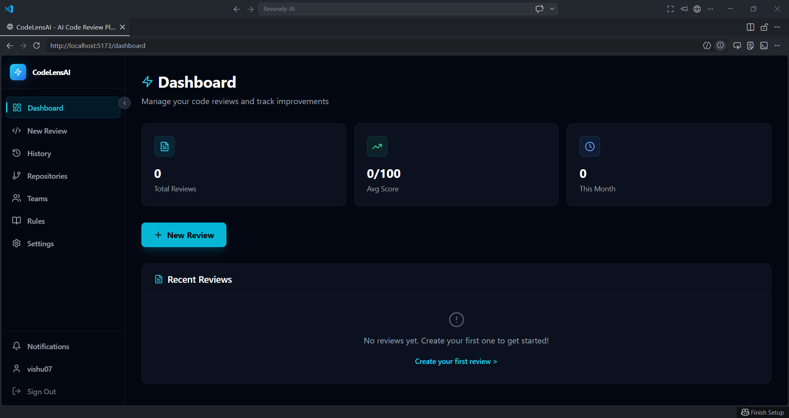

# Reviewly AI - AI Code Review Automation Platform ⚡

Reviewly AI is a modern, full-stack **AI-assisted code review** web app with a polished dashboard, protected workspaces, review history, rule-based issue detection, and Supabase-powered authentication/database workflows - built with **React + TypeScript + Vite**.

🌐 **Live Demo:** Coming soon  
📦 **Repository:** https://github.com/im-vishu/Reviewly-AI

---

## 📸 Screenshots

### 🏠 Landing Page

<p align="center">
  
</p>

<br/>

### 📊 Dashboard

<p align="center">
  
</p>

<br/>

### 🔍 Review Details

<p align="center">
  
</p>

---

## ✨ Features

- 🔐 **Authentication-ready flows** with Supabase email/password and OAuth UI
- 🧭 **Protected dashboard shell** with responsive sidebar navigation
- 📝 **Create new code reviews** by pasting source code
- 🧠 **Built-in analyzer** for common security, reliability, and quality issues
- 🚨 **Issue detection** for hardcoded secrets, `eval`, console logs, unsafe HTML assignment, and swallowed exceptions
- 📄 **Review details page** with Monaco Editor read-only code views
- 📚 **Review history** with search, sorting, and infinite-scroll style loading
- 👤 **Profile management** with Supabase-backed profile updates
- 🧩 **Workspace pages** for repositories, teams, rules, settings, and notifications
- 📤 **Markdown export** for review reports
- 🛡️ **Supabase RLS migrations** for secure per-user and team-scoped data access

---

## 🧰 Tech Stack

- ⚛️ **React 18**
- 🟦 **TypeScript**
- ⚡ **Vite**
- 🎨 **Tailwind CSS**
- 🧭 **React Router**
- 🗄️ **Supabase**
- 🧑‍💻 **Monaco Editor**
- ✅ **ESLint**
- 🎯 **Lucide React**

---

## 🗂️ Project Structure

```text
.
├─ .github/             # GitHub workflows and templates
├─ src/
│  ├─ components/
│  │  ├─ layout/        # App layout and navigation
│  │  └─ ui/            # Shared UI components
│  ├─ contexts/         # Auth provider
│  ├─ lib/              # Supabase client, analyzer, validation, constants
│  ├─ pages/            # Route-level pages
│  ├─ types/            # Shared TypeScript models
│  ├─ App.tsx           # Route configuration
│  └─ main.tsx          # React entry point
├─ supabase/
│  └─ migrations/       # Database schema and RLS policies
├─ index.html
├─ package.json
├─ tailwind.config.js
├─ vite.config.ts
└─ ...
```

---

## 🔐 Environment Variables

Create a `.env` file in the project root:

```env
VITE_SUPABASE_URL=your_supabase_project_url
VITE_SUPABASE_ANON_KEY=your_supabase_anon_key
```

✅ `.env` is ignored by git - **do not commit secrets**.

> Public pages can render without Supabase values, but authentication, profile updates, review creation, history, notifications, and workspace data require a configured Supabase project.

---

## 🗄️ Supabase Setup

Apply the migration files in `supabase/migrations` in order:

```text
20260425054649_create_codelens_base_tables.sql
20260425054724_create_codelens_review_tables.sql
20260427054501_add_audit_logs_and_session_mgmt.sql
```

These migrations create:

- Profiles
- Teams and team members
- Reviews and review issues
- Connected repositories
- Pull request review metadata
- Custom rules
- User settings
- Notifications
- API keys
- Audit logs
- Row-level security policies

---

## 🚀 Setup & Development

### ✅ Prerequisites

- Node.js **>= 18**
- npm **>= 9**
- Supabase project for full backend functionality

### 1) Clone the repository

```bash
git clone https://github.com/im-vishu/Reviewly-AI.git
cd Reviewly-AI
```

### 2) Install dependencies

```bash
npm install
```

### 3) Configure environment variables

```bash
cp .env.example .env
```

Then update `.env` with your Supabase project values.

### 4) Run locally

```bash
npm run dev
```

Open:

```text
http://127.0.0.1:5173
```

---

## 🧪 Quality Checks

```bash
npm run typecheck
npm run lint
npm run build
```

Current known state:

- ✅ TypeScript passes
- ✅ Production build passes
- ⚠️ ESLint passes with warnings only
- ⚠️ `npm audit` reports remaining dependency advisories

---

## 🧭 Routes

### Public Routes

- `/` - Landing page
- `/auth/signin` - Sign in
- `/auth/signup` - Sign up
- `*` - 404 fallback

### Protected Routes

- `/dashboard` - Review overview and recent reviews
- `/profile` - Account profile
- `/history` - Review history
- `/review/new` - Create a new review
- `/review/:id` - Review details
- `/repos` - Connected repositories
- `/teams` - Teams
- `/rules` - Review rules
- `/settings` - User settings
- `/notifications` - User notifications

---

## 🧠 Analyzer Notes

The current analyzer is implemented in:

```text
src/lib/analyzer.ts
```

It runs locally and detects a focused set of common problems:

- Hardcoded secrets
- `eval` usage
- Console statements
- Swallowed exceptions
- Unsafe `innerHTML` assignment

For production-grade AI review, move analysis to a secure backend or Supabase Edge Function and call your LLM provider there. Do not expose private provider keys in the browser.

---

## ☁️ Deploying

This Vite app can be deployed to platforms like **Vercel**, **Netlify**, or **Cloudflare Pages**.

### Recommended Vercel Settings

- **Build Command:** `npm run build`
- **Output Directory:** `dist`
- **Install Command:** `npm install`

Set environment variables in your deployment dashboard:

- `VITE_SUPABASE_URL`
- `VITE_SUPABASE_ANON_KEY`

After deployment, verify:

- Landing page loads
- Deep links refresh without 404
- Auth redirects are configured in Supabase
- Protected routes redirect correctly when logged out
- Review creation works after sign-in

---

## 🐞 Troubleshooting

### Blank page or Supabase config warning

Make sure `.env` exists and contains:

```env
VITE_SUPABASE_URL=...
VITE_SUPABASE_ANON_KEY=...
```

Then restart the dev server.

### Protected pages redirect to sign-in

This is expected when no user is logged in. Sign in or create an account through Supabase Auth.

### Review creation fails

Check:

- Supabase migrations are applied
- RLS policies exist
- User is authenticated
- Browser console and Supabase logs for insert errors

### OAuth sign-in fails

Check:

- Provider is enabled in Supabase Auth
- Redirect URLs include local and deployed URLs
- OAuth client ID/secret are configured in Supabase

### Vite port already in use

```powershell
netstat -ano | findstr :5173
Stop-Process -Id <PID> -Force
```

---

## ✅ Production Readiness Checklist

- [ ] Apply all Supabase migrations
- [ ] Configure Supabase Auth redirect URLs
- [ ] Enable required OAuth providers
- [ ] Add real Terms, Privacy, Docs, Pricing, and Status links
- [ ] Add screenshots to `src/assets/screenshots`
- [ ] Add backend AI review service or Supabase Edge Function
- [ ] Resolve remaining npm audit advisories
- [ ] Clean remaining ESLint warnings
- [ ] Add automated tests for auth guards, analyzer behavior, and review creation

---

## 🤝 Contributing

PRs are welcome!

1. Fork the repo
2. Create a feature branch
3. Commit with meaningful messages
4. Run quality checks
5. Open a pull request

```bash
npm run typecheck
npm run lint
npm run build
```

---

## 📄 License

MIT

---

**Reviewly AI - AI Code Review Automation Platform** © 2026 - Created by Vishant Chaudhary
